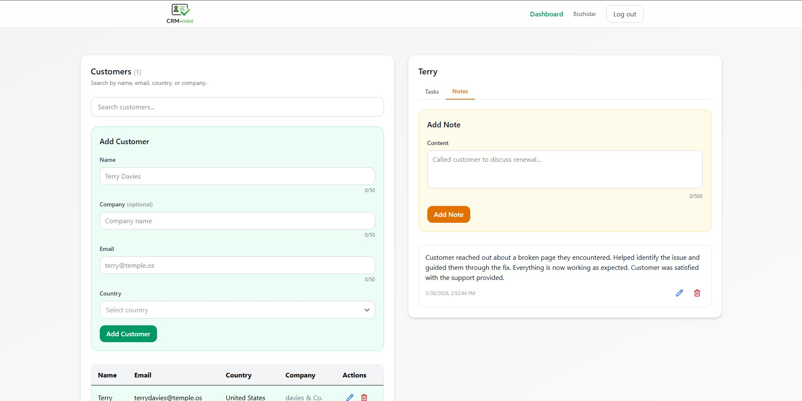

# Mini CRM

A full-stack mini CRM application built with React (Vite) and ASP.NET Core Web API. The app allows users to manage customers and their associated tasks/notes through a simple and responsive interface.

## Screenshots





## Features
- Create, view, search, and delete customers
- View tasks/notes for a selected customer
- Create, complete, edit, and delete tasks/notes
- Client-side search filtering
- Responsive UI for mobile and desktop

## Frontend

- React (Vite)
- TailwindCSS
- Axios
- React Select
- Lucide React
- country-list  

## Backend

- ASP.NET Core Web API
- ASP.NET Core Identity
- Entity Framework Core

## Database
- PostgreSQL

## API Overview
```
  Auth

- POST	   /api/auth/register	        Register a new user   
- POST	   /api/auth/login	            Authenticate user and return cookies    
- POST	   /api/auth/logout	            Logout current user   
- GET	   /api/auth/me	                Get current authenticated user    

  Customers

- GET	   /api/customers	            Retrieve all customers
- POST	   /api/customers	            Create a new customer
- GET	   /api/customers/{id}	        Get a specific customer
- PUT	   /api/customers/{id}	        Update a customer
- DELETE   /api/customers/{id}	        Delete a customer

  Customer Tasks

- GET	   /api/customers/{id}/tasks	Get all tasks for a customer
- POST	   /api/customers/{id}/tasks	Create a task for a customer

  Customer Notes

- GET	   /api/customers/{id}/notes	Get all notes for a customer
- POST	   /api/customers/{id}/notes	Create a note for a customer

  Notes

- GET	   /api/notes/{id}	            Retrieve a specific note
- PUT	   /api/notes/{id}	            Update a note
- DELETE   /api/notes/{id}	            Delete a note

  Tasks

- GET	   /api/tasks/{id}	            Retrieve a specific task
- PUT	   /api/tasks/{id}	            Update a task
- DELETE   /api/tasks/{id}	            Delete a task
- PUT	   /api/tasks/{id}/complete	    Mark a task as completed
```


## Getting Started
### Backend
```
cd Backend
dotnet restore
dotnet run
```


### Frontend
```
cd Frontend
npm install
npm run dev
```

Create a .env file in the frontend with:

```VITE_API_BASE=http://localhost:5269/api```


## Notes
This project is intended for learning and demonstration purposes
