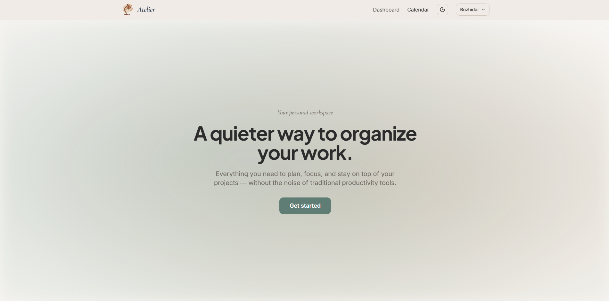
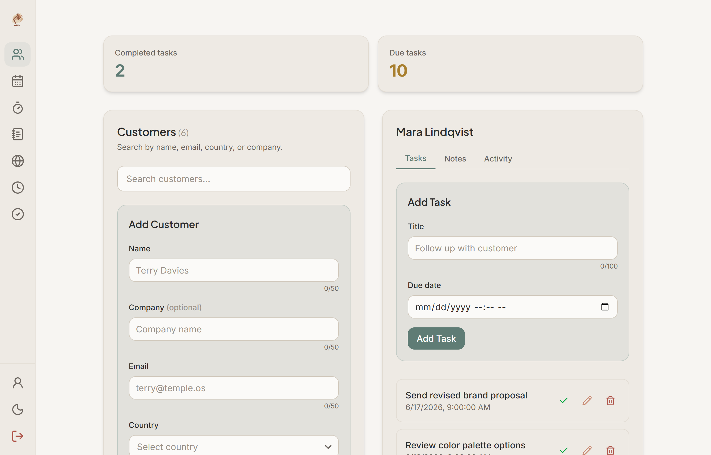
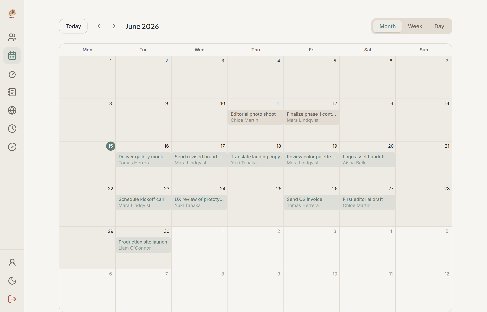
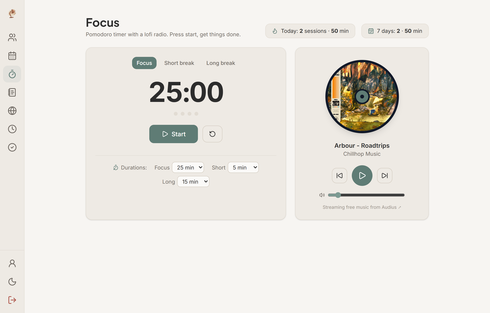
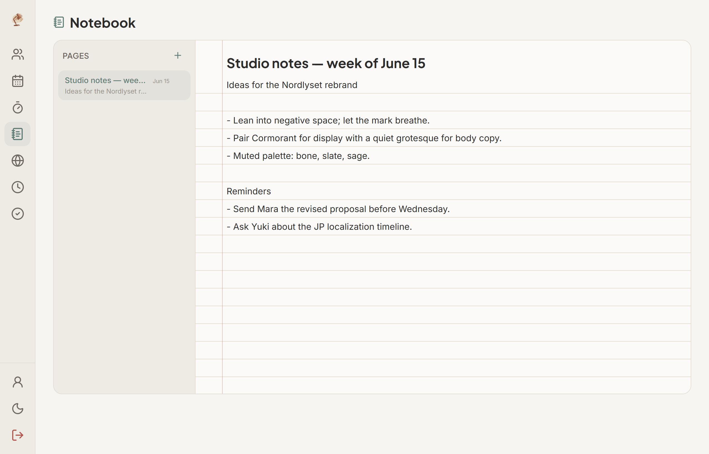

# Atelier

> A quieter way to organize your work.

Atelier is a full-stack **personal workspace** — a calm, distraction-free home for your
clients, schedule, notes, and focus time. It began as a mini CRM and grew into a small
suite of connected modules that share one account, one theme, and one cohesive UI.

Built with **React (Vite)** on the front end and an **ASP.NET Core Web API** on the back,
served as a single same-origin app and deployed to Render.

## Live demo

- **App:** https://mini-crm-0d2h.onrender.com/

> The backend runs on a free Render instance, so the first request after a period of
> inactivity may take a few seconds to spin up.

## Screenshots

<!-- Screenshots live in docs/screenshots/. Replace these as the UI evolves. -->











## Features

Atelier is organized into modules, each reachable from the workspace navigation once
you sign in.

- **CRM** — Create, search, edit, and delete clients. Track per-client tasks and notes,
  with a running activity log of what changed.
- **Tasks** — Due-soon and completed task views, a sortable task table, due dates, and
  one-click completion. Tasks feed both the dashboard and the calendar.
- **Calendar** — Month, week, and day views of your tasks so deadlines stay visible at a
  glance.
- **Focus** — A built-in Pomodoro timer paired with an ambient lo-fi radio (streamed via
  the Audius API) to help you drop into deep work. Completed sessions are logged.
- **Notebook** — Ruled-paper text notes with autosave, a page list, and a clean editor
  for capturing ideas and meeting notes.
- **Public space** — An opt-in, reciprocal activity feed. When two users both go public,
  each sees a content-free stream of the other's activity (no private data is shared).
- **Profile & settings** — Edit your profile, change your password, and manage workspace
  preferences.

### Accounts & security

- Email/password registration and login, plus **Google sign-in (OAuth)**.
- Forgot/reset password via email.
- Cookie-based sessions with **anti-forgery (CSRF) tokens**, per-IP **rate limiting**, and
  account **lockout** after repeated failed logins.
- **Email reminders** — a daily digest of upcoming tasks, sent via Resend in production
  (SMTP/Mailpit in local dev).

## Tech stack

**Frontend**
- React 19 + Vite 8
- React Router 7
- Tailwind CSS 4
- Axios
- React Select, Lucide React, country-list
- Vitest + React Testing Library

**Backend**
- ASP.NET Core Web API (.NET 10)
- ASP.NET Core Identity
- Entity Framework Core (Npgsql)
- Data Protection keys persisted to the database

**Database**
- PostgreSQL

**Infrastructure**
- Docker (multi-stage build) deployed to Render as a single Web Service
- Resend (transactional email) in production; Mailpit for local dev

## Architecture

- **Single same-origin deployment.** The Vite build is emitted to the API's `wwwroot`, so
  one ASP.NET Core service serves both the SPA and the `/api` routes. This keeps the auth
  cookie same-origin (no third-party-cookie issues) and avoids CORS in production.
- **Cookie auth + CSRF.** Identity issues an HttpOnly auth cookie; an anti-forgery token
  is handed to the SPA via a readable `XSRF-TOKEN` cookie and echoed back in the
  `X-XSRF-TOKEN` header on mutating requests.
- **Data Protection keys in Postgres.** Keys are persisted to the database so they survive
  Render's ephemeral filesystem — otherwise every deploy would invalidate all sessions.
- **Migrations on startup.** Pending EF Core migrations are applied automatically when the
  app boots, keeping the deployed database in sync.
- **Service layer.** Controllers stay thin and delegate to injected services
  (`CustomerService`, `TaskService`, `NoteService`, `NotebookService`, `FocusSessionService`,
  `ActivityService`, `UserEventService`, `UserSettingsService`, `ReminderDigestService`).
- **Pluggable email.** A Resend HTTPS sender is used when an API key is configured (Render
  blocks outbound SMTP); otherwise an SMTP sender targets Mailpit locally.

## API overview

All routes are prefixed with `/api`. Mutating requests require the anti-forgery header.

```
Auth
- POST   /api/auth/register          Register a new user
- POST   /api/auth/login             Authenticate and set the session cookie
- POST   /api/auth/logout            Log out the current user
- GET    /api/auth/me                Get the current authenticated user
- PUT    /api/auth/profile           Update the current user's profile
- POST   /api/auth/password          Change password
- POST   /api/auth/forgot-password   Send a password-reset email
- POST   /api/auth/reset-password    Reset password with a token
- GET    /api/auth/google            Begin Google OAuth sign-in
- GET    /api/auth/google/complete   Finish Google OAuth sign-in

Customers
- GET    /api/customers              List customers
- POST   /api/customers              Create a customer
- GET    /api/customers/{id}         Get a customer
- PUT    /api/customers/{id}         Update a customer
- DELETE /api/customers/{id}         Delete a customer
- GET    /api/customers/{id}/tasks   List a customer's tasks
- POST   /api/customers/{id}/tasks   Create a task for a customer
- GET    /api/customers/{id}/notes   List a customer's notes
- POST   /api/customers/{id}/notes   Create a note for a customer

Tasks
- GET    /api/tasks/due              Tasks due soon
- GET    /api/tasks/completed        Completed tasks
- GET    /api/tasks/calendar         Tasks for the calendar views
- GET    /api/tasks/{id}             Get a task
- PUT    /api/tasks/{id}             Update a task
- PUT    /api/tasks/{id}/complete    Mark a task complete
- DELETE /api/tasks/{id}             Delete a task

Notes
- GET    /api/notes/{id}             Get a note
- PUT    /api/notes/{id}             Update a note
- DELETE /api/notes/{id}             Delete a note

Activities
- GET    /api/activities/{customerId}  Activity log for a customer

Notebook
- GET    /api/notebook               List notebook pages
- POST   /api/notebook               Create a notebook page
- PUT    /api/notebook/{id}          Update a notebook page
- DELETE /api/notebook/{id}          Delete a notebook page

Focus
- GET    /api/focus/sessions         List focus sessions
- POST   /api/focus/sessions         Log a focus session

Public space
- GET    /api/public-space/feed      Reciprocal activity feed

User settings
- GET    /api/user-settings          Get workspace settings
- PUT    /api/user-settings          Update workspace settings

Jobs
- POST   /api/jobs/send-reminders    Trigger the task-reminder digest (secured)
```

Swagger UI is available at `/swagger` when running in development.

## Getting started

### Prerequisites

- [.NET 10 SDK](https://dotnet.microsoft.com/)
- [Node.js](https://nodejs.org/) (with npm)
- A PostgreSQL database
- (Optional) Docker, for the local Mailpit mail catcher

### 1. Database & local services

Point the backend at any PostgreSQL instance by setting the `DefaultConnection`
connection string (see Configuration below). EF Core migrations run automatically on
startup, so you don't need to apply them by hand.

To catch reminder/reset emails locally, start Mailpit:

```bash
docker compose -f docker-compose.dev.yml up -d
# Web UI: http://localhost:8025
```

### 2. Backend

```bash
cd backend
dotnet restore
dotnet run
```

The API listens on the URL printed in the console (e.g. `http://localhost:5269`).

### 3. Frontend

```bash
cd frontend
npm install
npm run dev
```

Create a `frontend/.env` file with the API base:

```
VITE_API_BASE=http://localhost:5269/api
```

The Vite dev server runs on `http://localhost:5173` and proxies/calls the API at the
base above.

## Configuration

Backend settings live in `appsettings.json` / `appsettings.Development.json`
(the latter is gitignored). Key values:

| Setting | Purpose |
| --- | --- |
| `ConnectionStrings:DefaultConnection` | PostgreSQL connection string (**required**) |
| `Cors:AllowedOrigins` | Origins allowed in development (e.g. `http://localhost:5173`) |
| `Authentication:Google:ClientId` / `ClientSecret` | Enables Google sign-in when both are set |
| `Email:ResendApiKey` | Use Resend's HTTPS API for outbound mail (production) |
| `Email:Host` / `Port` / `Username` / `Password` | SMTP settings (local dev / Mailpit) |
| `Email:FromAddress` / `FromName` / `AppBaseUrl` | Sender identity and links in emails |
| `Jobs:CronSecret` | Shared secret to authorize the reminder-digest job |

Optional features stay dark until configured: **Google sign-in** only activates when both
Google credentials are present, and email uses **Resend** when an API key is set, falling
back to **SMTP** otherwise.

## Testing

Frontend unit tests (Vitest + Testing Library):

```bash
cd frontend
npm test -- --pool=threads
```

> The `--pool=threads` flag is required in this environment — the default worker pool can
> hang.

Backend tests live in `backend.Tests`:

```bash
dotnet test
```

## Deployment

The app ships as a single Docker image (`Dockerfile`), built in three stages:

1. Build the React app with Vite (`VITE_API_BASE=/api`, baked in at build time).
2. Publish the ASP.NET Core API.
3. Copy the SPA build into the API's `wwwroot` and run the API.

On Render this runs as one Web Service serving both the SPA and the API from the same
origin. Migrations apply on startup, and Data Protection keys are stored in Postgres so
sessions survive deploys.

## Project status

Actively evolving. Atelier started as a learning/demonstration CRM and is being grown into
a broader personal workspace — see the module list above for what's live today.
