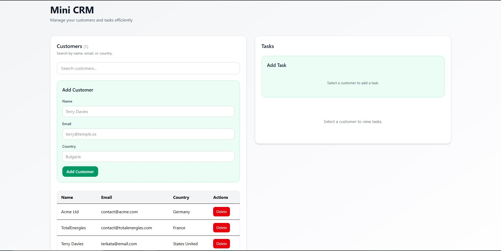
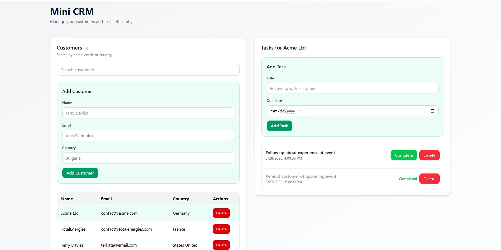
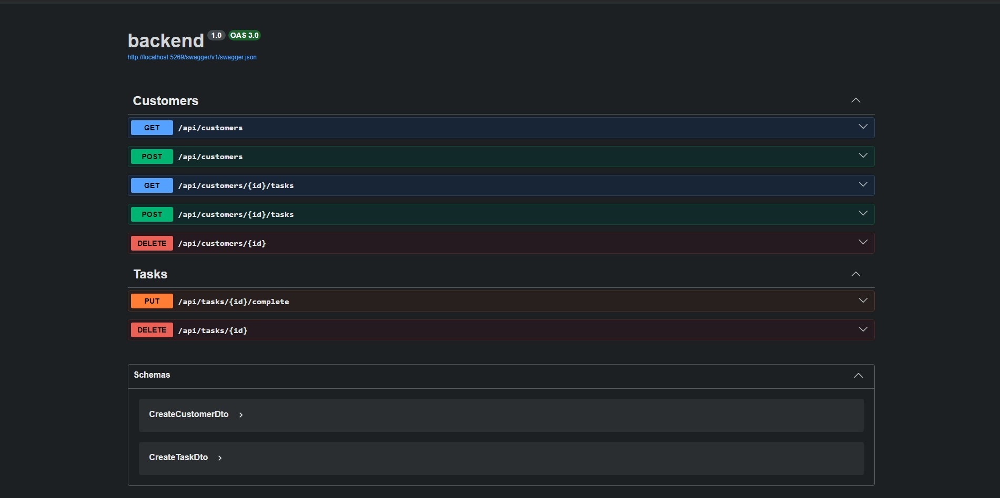

# Mini CRM

A full-stack mini CRM application built with React (Vite) and ASP.NET Core Web API. The app allows users to manage customers and their associated tasks through a simple and responsive interface.

## Features
Create, view, search, and delete customers
View tasks for a selected customer
Create, complete, and delete tasks
Client-side search filtering
Responsive UI for mobile and desktop
Clean separation between frontend and backend
Tech Stack

## Screenshots






## Frontend

- React (Vite)
- TailwindCSS
- Axios

## Backend

- ASP.NET Core Web API
- Entity Framework Core
- SQLite

## API Overview
- GET /api/customers – get all customers
- POST /api/customers – create customer
- DELETE /api/customers/{id} – delete customer
- GET /api/customers/{id}/tasks – get tasks for customer
- POST /api/customers/{id}/tasks – create task
- PUT /api/tasks/{id}/complete – mark task as completed
- DELETE /api/tasks/{id} – delete task

## Getting Started
### Backend
```
cd Backend
dotnet restore
dotnet run
```


### Frontend
```
cd Frontend
npm install
npm run dev
```

Create a .env file in the frontend with:

```VITE_API_BASE=http://localhost:5269/api```

## Project Structure
```
Frontend/
  src/
    api/
    components/
    pages/

Backend/
  Controllers/
  Models/
  Dtos/
  Data/
```
## Notes
This project is intended for learning and demonstration purposes
No authentication is implemented
Data is shared across all users